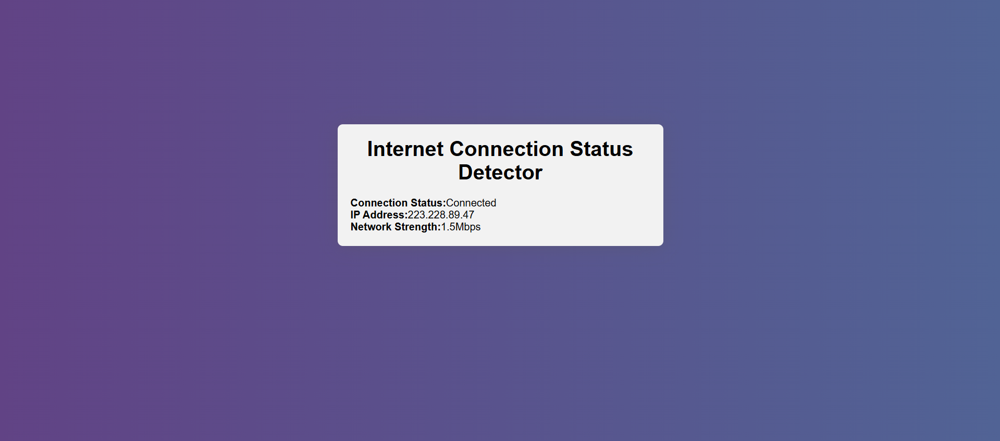

# 📡 Internet Status Checker

A simple web app built with **HTML, CSS, and JavaScript** that lets you check your internet connection status in real time.

## 🚀 Live Demo
👉 [Check it here](https://internetstatuschecker.netlify.app/)

## ✨ Features
- ✅ Detects whether you are **online or offline**
- 🔄 Updates status dynamically without refreshing
- 🎨 Clean and responsive UI
- 🌐 Works across all modern browsers

## 🛠️ Technologies Used
- HTML
- CSS
- JavaScript (navigator.onLine API)

## 📷 Preview
 

## 📌 How to Use
1. Open the app in your browser.
2. Disconnect or reconnect your internet.
3. The app will show your current status instantly.

## 🤝 Contributing
Feel free to fork this repo and improve the project! Pull requests are welcome.

## 📄 License
This project is open-source and available under the [MIT License](LICENSE).
